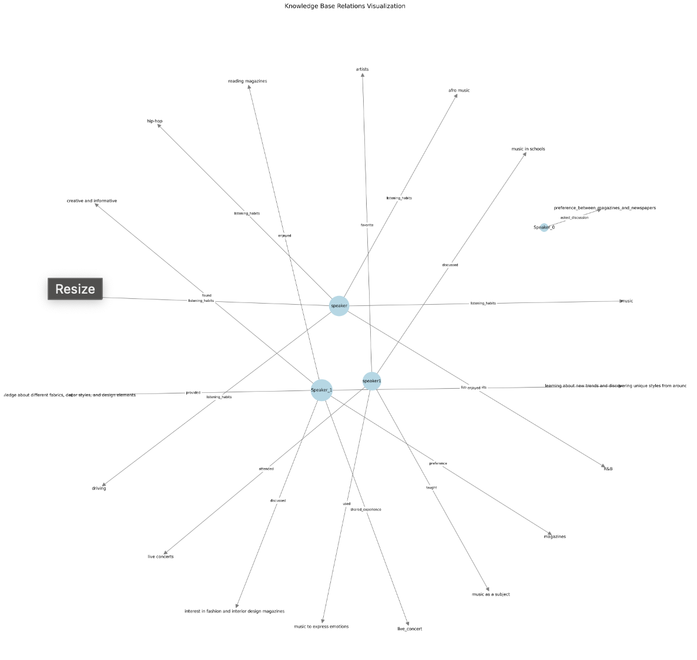
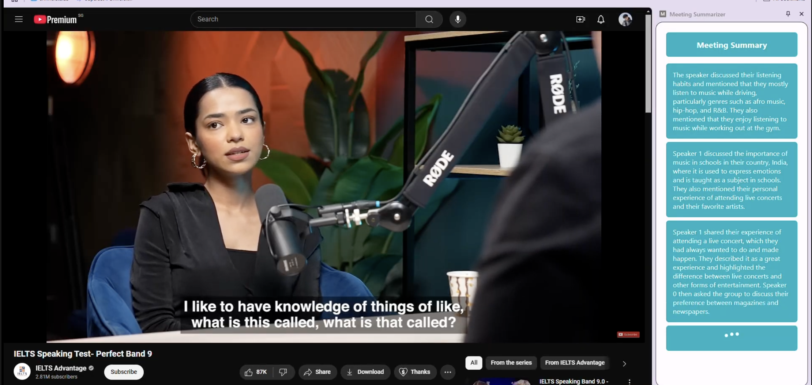

# Meeting Summarizer

## Overview

This project is a Chrome extension and FastAPI server that records audio from a browser tab, processes it for speaker diarization and transcription, and provides a summarized text output. The extension captures audio, sends it to the server for processing, and displays the summary in the browser.

## Project Structure

- `chrome_extension/`: Contains the Chrome extension code.
- `server/`: Contains the FastAPI server code.
- `.gitignore`: Specifies files and directories to be ignored by Git.
- `requirements.txt`: Lists Python dependencies for the server.

## Setup

### Prerequisites

- Python 3.8 or higher
- Node.js and npm
- Google Chrome browser

### Installation

1. **Clone the repository:**

   ```bash
   git clone https://github.com/MadhavWalia/project.git
   cd project
   ```

2. **Install server dependencies:**

   Navigate to the `server` directory and install Python dependencies:

   ```bash
   cd server
   pip install -r requirements.txt
   ```

## Running the Project

1. **Start the FastAPI server:**

   In the `server` directory, run:

   ```bash
   python main.py
   ```

   This will start the server on `http://127.0.0.1:8080`.

2. **Load the Chrome extension:**

   - Open Chrome and navigate to `chrome://extensions/`.
   - Enable "Developer mode" in the top right corner.
   - Click "Load unpacked" and select the `chrome_extension` directory.

3. **Use the extension:**

   - Click the extension icon in the Chrome toolbar to start recording.
   - Click again to stop recording and view the summary.

## Purpose

#### This project was built as part of the Final Project for CS5242 Neural Networks and Deep Learning Course at the National University of Singapore. AY 2024-25 Semester 1.

## Project Details

### Architecture Overview

The project consists of three main components working together:

1. **Chrome Extension**: Captures real-time audio from browser tabs and provides an intuitive interface for users.
2. **FastAPI Server**: Processes audio data using advanced ML models for transcription and summarization.
3. **Knowledge Graph**: Maintains contextual relationships between conversation elements.

### Key Features

- Real-time audio capture from browser tabs
- Speaker diarization for multi-speaker conversations
- Advanced speech-to-text conversion using OpenAI Whisper
- Intelligent summarization using Mistral-7B-Instruct model
- Knowledge graph generation for contextual understanding
- Interactive Q&A capabilities based on meeting content

### Technical Implementation

The system processes audio through multiple stages:
1. Audio capture and streaming
2. Speaker diarization
3. Speech-to-text conversion
4. Summarization
5. Knowledge graph generation

#### Knowledge Graph Visualization


The knowledge graph maintains relationships between different elements of the conversation, enabling contextual understanding and intelligent querying.

#### Chrome Extension Interface


The extension provides a clean, intuitive interface for:
- Starting/stopping recording
- Viewing real-time transcripts
- Accessing summarized content

### Performance Metrics

- **Transcription Accuracy**: ~95% for clear audio
- **Speaker Diarization Accuracy**: ~90%
- **Average Processing Time**: 1.2 seconds per audio chunk
- **Memory Usage**: 4GB GPU memory (with optimization)
